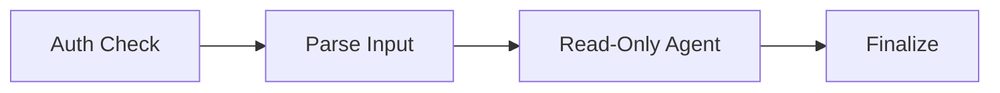

# Strands Command GitHub Actions

An agentic execution system for GitHub repositories that processes `/strands` commands in issues and pull requests.

## Quick Start

On repositories onboarded to the strands command, simply leave a comment that starts with `/strands` on an issue or pull request (Note: This must be a comment, not a PR comment or review).

By default, the strands command will do a few different things:
- If commented on an Issue, the "Refiner" agent will be triggered
- If commented on a Pull Request, the "Implementer" agent will be triggered

You can trigger different agents by passing in a keyword after the `/strands` command:
- `/strands implement` on an Issue will trigger the "Implementer" agent, and try to implement the issue as a feature request with a Pull Request
- `/strands release-notes` on an Issue will trigger the "Release Notes" agent, and attempt to create release notes for a new release

Any text after the `/strands` command will be passed along to the agent as input as well
- `/strands <agent-keyword> <Input to agent>`

## Overview

The Strands Command system enables AI-powered automation in GitHub repositories through:

- **Issue Comment Processing**: Responds to `/strands` commands in issues and PRs
- **Controlled AI Execution**: Runs AI agents with read-only and write-separated permissions
- **AWS Integration**: Secure OIDC-based authentication with Bedrock AI models
- **Security-First Design**: Manual approval gates and permission isolation

### Github Workflow Diagram




## Onboarding a Repository to Strands Command

1. **Create a Strands Command Github Workflow** (see [Setting up Strands Command Workflow](#setting-up-strands-command-workflow))
2. **Set up AWS Resources** (see [Setup AWS Resources](#setup-aws-resources))
3. **Configure GitHub Secrets**:
   - `AWS_ROLE_ARN`: Your IAM role ARN
   - `AWS_SECRETS_MANAGER_SECRET_ID`: The ID of your AWS Secrets Manager secret containing agent configuration

### Setting Up Strands Command Workflow

Main workflow that orchestrates the complete Strands command execution. This is added to any repository that wants to use the Strands command.

1. **Authorization Check**: Validates user permissions and applies approval gates
2. **Parse Input**: Parses input and prepares execution context
3. **Read-Only Execution**: Runs Agent in Read-only sandbox
4. **Finalize**: Runs any write command from a Read-only executed agent, and cleans up any labels

**Example `strands-command.yml`**
<details>

```yml
name: Strands Command Handler

on:
  issue_comment:
    types: [created]
  workflow_dispatch:
    inputs:
      issue_id:
        description: 'Issue ID to process (can be issue or PR number)'
        required: true
        type: string
      command:
        description: 'Strands command to execute'
        required: false
        type: string
        default: ''
      session_id:
        description: 'Optional session ID to use'
        required: false
        type: string
        default: ''

jobs:
  authorization-check:
    if: startsWith(github.event.comment.body, '/strands') || github.event_name == 'workflow_dispatch'
    name: Check access
    permissions: read-all
    runs-on: ubuntu-latest
    outputs:
      approval-env: ${{ steps.auth.outputs.approval-env }}
    steps:
      - name: Check Authorization
        id: auth
        uses: strands-agents/devtools/authorization-check@main
        with:
          skip-check: ${{ github.event_name == 'workflow_dispatch' }}
          username: ${{ github.event.comment.user.login || 'invalid' }}
          allowed-roles: 'triage,write,admin'

  setup-and-process:
    needs: [authorization-check]
    environment: ${{ needs.authorization-check.outputs.approval-env }}
    permissions:
      # Needed to create a branch for the Implementer Agent
      contents: write
      # These both are needed to add the `strands-running` label to issues and prs
      issues: write
      pull-requests: write
    runs-on: ubuntu-latest
    steps:
      - name: Parse input
        id: parse
        uses: strands-agents/devtools/strands-command/actions/strands-input-parser@main
        with:
          issue_id: ${{ inputs.issue_id }}
          command: ${{ inputs.command }}
          session_id: ${{ inputs.session_id }}

  execute-readonly-agent:
    needs: [setup-and-process]
    permissions:
      contents: read
      issues: read
      pull-requests: read
      id-token: write # Required for OIDC
    runs-on: ubuntu-latest 
    timeout-minutes: 60
    steps:

      # Add any steps here to set up the environment for the Agent in your repo
      # setup node, setup python, or any other dependencies

      - name: Run Strands Agent
        id: agent-runner
        uses: strands-agents/devtools/strands-command/actions/strands-agent-runner@main
        with:
          aws_role_arn: ${{ secrets.AWS_ROLE_ARN }}
          aws_secrets_manager_secret_id: ${{ secrets.AWS_SECRETS_MANAGER_SECRET_ID }}
          write_permission: 'false'

  finalize:
    if: always()
    needs: [setup-and-process, execute-readonly-agent]
    if: always()
    permissions:
      contents: write
      issues: write
      pull-requests: write
    runs-on: ubuntu-latest 
    timeout-minutes: 30
    steps:
      - name: Execute write operations
        uses: strands-agents/devtools/strands-command/actions/strands-finalize@main
```

</details>

### Setup AWS Resources

The Strands Command Github workflow requires the following resources in an AWS Account:

#### 1. AWS Secrets Manager Secret

Create a Secrets Manager secret containing your agent configuration. The secret should be a JSON object with the following keys:

```json
{
  "AGENT_SESSIONS_BUCKET": "your-sessions-bucket-name",
  "LANGFUSE_PUBLIC_KEY": "your-langfuse-public-key",
  "LANGFUSE_SECRET_KEY": "your-langfuse-secret-key",
  "LANGFUSE_HOST": "https://us.cloud.langfuse.com",
  "EVALS_SQS_QUEUE_ARN": "arn:aws:sqs:us-west-2:123456789012:your-evals-queue"
}
```

| Key | Required | Description |
|-----|----------|-------------|
| `AGENT_SESSIONS_BUCKET` | Yes | S3 bucket name for storing agent sessions |
| `LANGFUSE_PUBLIC_KEY` | No | Langfuse public key for telemetry |
| `LANGFUSE_SECRET_KEY` | No | Langfuse secret key for telemetry |
| `LANGFUSE_HOST` | No | Langfuse host URL (defaults to `https://us.cloud.langfuse.com`) |
| `EVALS_SQS_QUEUE_ARN` | No | SQS queue ARN for evaluation triggers |

**Note:** All values from Secrets Manager can be overridden by providing explicit inputs to the `strands-agent-runner` action.

#### 2. S3 Bucket

Create a standard S3 bucket in your account for storing agent sessions.

#### 3. IAM Role Setup

- Create a Github OIDC in your account: https://docs.github.com/en/actions/how-tos/secure-your-work/security-harden-deployments/oidc-in-aws
- Create a new IAM role with the following trust policy and permission policy:

Trust policy:

```json
{
  "Version": "2012-10-17",
  "Statement": [
    {
      "Effect": "Allow",
      "Principal": {
        "Federated": "arn:aws:iam::YOUR_ACCOUNT_ID:oidc-provider/token.actions.githubusercontent.com"
      },
      "Action": "sts:AssumeRoleWithWebIdentity",
      "Condition": {
        "StringEquals": {
          "token.actions.githubusercontent.com:aud": "sts.amazonaws.com"
        },
        "StringLike": {
          "token.actions.githubusercontent.com:sub": "repo:YOUR_ORG/YOUR_REPO:*"
        }
      }
    }
  ]
}
```

Permission Policy:

```json
{
  "Version": "2012-10-17",
  "Statement": [
    {
      "Sid": "SecretsManagerAccess",
      "Effect": "Allow",
      "Action": "secretsmanager:GetSecretValue",
      "Resource": "arn:aws:secretsmanager:*:YOUR_ACCOUNT_ID:secret:YOUR_SECRET_NAME*"
    },
    {
      "Sid": "BedrockAccess",
      "Effect": "Allow",
      "Action": [
        "bedrock:InvokeModelWithResponseStream",
        "bedrock:InvokeModel"
      ],
      "Resource": "*"
    },
    {
      "Sid": "S3SessionsAccess",
      "Effect": "Allow",
      "Action": [
        "s3:PutObject",
        "s3:GetObject",
        "s3:DeleteObject"
      ],
      "Resource": [
        "arn:aws:s3:::YOUR_AGENT_SESSIONS_BUCKET/*"
      ]
    },
    {
      "Sid": "S3ListBucket",
      "Effect": "Allow",
      "Action": "s3:ListBucket",
      "Resource": [
        "arn:aws:s3:::YOUR_AGENT_SESSIONS_BUCKET"
      ]
    }
  ]
}
```


## Actions

### strands-input-parser

Parses `/strands` command input and prepares execution parameters for the agent runner.

**Inputs:**
- `issue_id` (optional): Issue or PR number
- `command` (optional): Strands command text
- `session_id` (optional): Session ID for resuming previous sessions

**Outputs:**
- Artifact: `strands-parsed-input` containing:
  - `branch_name`: Target branch for execution
  - `session_id`: Generated or provided session identifier
  - `system_prompt`: System instructions for the agent
  - `prompt`: Task description for the agent
  - `issue_id`: Associated issue number

**Features:**
- Adds `strands-running` label to the issue/PR
- Parses command syntax and determines execution mode (implement, refine, etc.)
- Generates unique session IDs for tracking
- Prepares appropriate system prompts based on command type
- Creates structured input artifact for downstream actions

### strands-agent-runner

Executes AI agents with AWS integration and controlled permissions.

**Inputs:**
- `aws_role_arn` (required): AWS IAM role ARN for authentication
- `aws_secrets_manager_secret_id` (required): AWS Secrets Manager secret ID containing agent configuration (fetches `sessions_bucket`, `langfuse_*`, and `evals_sqs_queue_arn`)
- `sessions_bucket` (optional): S3 bucket for session storage. Overrides value from Secrets Manager if provided
- `write_permission` (required): Permission level flag for Read-only Sandbox mode (`true`/`false`)

**Outputs:**
- Artifact: `repository-state` containing modified repository files (if changes exist)
- Artifact: `write-operations` containing deferred GitHub API operations (if write_permission is false)

**Features:**
- Downloads and processes parsed input from `strands-input-parser`
- Checks out target branch and sets up execution environment
- Python 3.13 and Node.js 20 environment setup
- Installs dependencies from requirements.txt using uv
- Configures AWS credentials with inline session policy
- Executes Strands agent with appropriate system and task prompts
- Captures repository state changes as tarball artifact
- Defers write operations to artifact when running in read-only mode
- Configures Git with Strands Agent identity

**Environment Variables:**
- `GITHUB_WRITE`: Permission level indicator
- `SESSION_ID`: Agent session identifier
- `S3_SESSION_BUCKET`: Session storage location
- `STRANDS_TOOL_CONSOLE_MODE`: Tool execution mode
- `BYPASS_TOOL_CONSENT`: Automated tool approval

### strands-finalize

Executes write operations and cleanup after agent execution completes.

**Inputs:**
- None (reads from artifacts)

**Features:**
- Downloads and processes parsed input artifact
- Applies repository state changes from artifact
- Pushes commits to target branch (skips if target is default branch)
- Executes deferred GitHub API operations from write-operations artifact
- Removes `strands-running` label from issue/PR
- Handles cleanup even if previous steps fail (always runs)

**Operations:**
- Extracts repository state tarball to temporary directory
- Configures Git credentials for pushing
- Stages and commits any remaining changes
- Force pushes to target branch if differences exist
- Executes write operations using Python write_executor.py script
- Passes issue_id context to write executor when available

## Agent SOPs

### Task Implementer (`task-implementer.sop.md`)

Implements features using test-driven development principles.

**Workflow**: Setup → Explore → Plan → Code → Commit → Pull Request

**Capabilities:**
- Feature implementation with TDD approach
- Comprehensive testing and documentation
- Pull request creation and iteration
- Code pattern following and best practices

**Trigger**: 
- Default when `/strands` is commented on a Pull Request
- `/strands implement` on an Issue

### Task Refiner (`task-refiner.sop.md`)

Refines and clarifies task requirements before implementation.

**Workflow**: Read Issue → Analyze → Research → Clarify → Iterate

**Capabilities:**
- Requirement analysis and gap identification
- Clarifying question generation
- Implementation planning and preparation
- Ambiguity resolution through user interaction

**Trigger**:
- Default when `/strands` is commented on an Issue

### Release Notes Generator (`task-release-notes.sop.md`)

Creates high-quality release notes highlighting major features and bug fixes.

**Workflow**: Parse Input → Query PRs → Categorize → Extract Code → Validate → Format

**Capabilities:**
- Analyzes merged PRs between git references
- Categorizes changes by significance
- Extracts and validates code examples
- Generates formatted markdown release notes
- Posts validation code and release notes as GitHub comments

**Trigger**:
- `/strands release-notes` on an Issue


## Security

### ⚠️ Important Security Considerations

**This workflow should only be used with trusted sources and should use AWS guardrails to help avoid prompt injection risks.**

### Security Features

#### Authorization Controls
- **Collaborator Verification**: Only users with write access get auto-approval
- **Manual Approval Gates**: Unknown users require manual approval via GitHub environments
- **Permission Separation**: Read and write operations isolated in separate jobs

#### AWS Security
- **OIDC Authentication**: No long-lived credentials stored in GitHub
- **Minimal Permissions**: Inline session policy limits access to required resources only
- **Temporary Credentials**: Each execution gets fresh, time-limited AWS credentials. You can further limit these by updating the `strands-agent-runner` "Configure AWS credentials" step, and set the `role-duration-seconds` value
- **Resource Scoping**: S3 access limited to specific session bucket

#### Prompt Injection Mitigation
- **Trusted Sources Only**: Implement strict user authorization
- **AWS Guardrails**: Use AWS Bedrock guardrails to filter malicious prompts
- **Input Validation**: Validate and sanitize all user inputs
- **Execution Isolation**: Separate read and write phases prevent unauthorized modifications

## Configuration

### GitHub Secrets

| Secret | Description | Example |
|--------|-------------|---------|
| `AWS_ROLE_ARN` | IAM role for AWS access | `arn:aws:iam::123456789012:role/GitHubActionsRole` |
| `AWS_SECRETS_MANAGER_SECRET_ID` | Secret ID containing agent configuration | `strands-agent-config` or `arn:aws:secretsmanager:us-east-1:123456789012:secret:strands-agent-config` |

### Environment Variables

The actions use these environment variables during execution:

| Variable | Purpose | Set By |
|----------|---------|--------|
| `GITHUB_WRITE` | Permission level indicator | Action |
| `SESSION_ID` | Agent session identifier | Workflow |
| `S3_SESSION_BUCKET` | Session storage location | Input |
| `STRANDS_TOOL_CONSOLE_MODE` | Tool execution mode | Action |
| `BYPASS_TOOL_CONSENT` | Automated tool approval | Action |

## Usage Examples

### Basic Task Implementation

Comment on an issue:
```
/strands Implement a new user authentication feature with JWT tokens
```

### Task Refinement

Comment on an issue with unclear requirements:
```
/strands refine Please help clarify the requirements for this feature
```

### Manual Execution

Use workflow dispatch with:
- **issue_id**: `123`
- **command**: `Implement the requested feature`
- **session_id**: `optional-session-id`

### Advanced Usage

```
/strands implement Create a REST API endpoint for user management with the following requirements:
1. CRUD operations for users
2. JWT authentication
3. Input validation
4. Unit tests with 90% coverage
5. OpenAPI documentation
```

---

**Note**: This system is designed for trusted environments. Always review security implications before deployment and implement appropriate guardrails for your use case.
